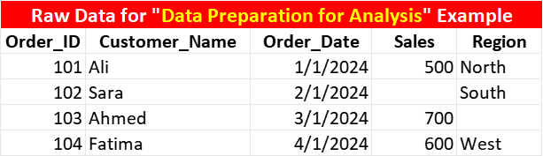
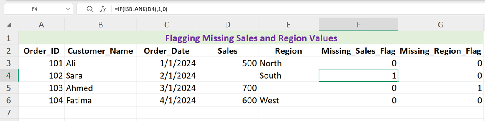

# 📊 Excel Data Cleaning & Preparation Example Project

## 📌 Project Overview
This project demonstrates my learning journey in **Data Cleaning and Data Preparation using Excel**.  
It includes handling missing values, feature engineering, and preparing raw data for analysis.

The raw dataset used is AI generated for Example purpose only.

---

**Raw Data**
Screenshot:


---

## 🎯 Objective
To practice and demonstrate:
- Data cleaning techniques  
- Handling missing values  
- Data preparation for analysis  
- Basic feature engineering using Excel formulas  

---

## 🧹 Data Cleaning Steps Performed

### 1. Missing Value Identification
Created flag columns to identify missing values:
- Missing Sales Flag  
- Missing Region Flag  

**Example formula:**
```excel
=IF(ISBLANK(D4),1,0)
````
Screenshot:


**Example formula:**
```excel
=IF(ISBLANK(E5),1,0)
````
Screenshot:


---

### 2. Handling Missing Numerical Data (Sales)

Missing sales values were replaced using the **average of existing values (mean imputation)**:

```excel
=IF(TRIM(E4)="",AVERAGE($E$3:$E$6),E4)
```
Screenshot:


---

### 3. Handling Missing Categorical Data (Region)

Missing region values were replaced with **"Unknown"**:

```excel
=IF(TRIM(G5)="","Unknown",G5)
```
Screenshot:


---

## ⚙️ Data Preparation Steps

### 1. Feature Engineering – Month Column

Extracted month from order date for time-based analysis:

```excel
=TEXT(C3,"mmm")
```
Screenshot:


---

### 2. Data Structuring

* Standardized date formats
* Created cleaned columns for analysis
* Ensured dataset is analysis-ready

---

## 📊 Final Dataset Improvements

After processing, the dataset became:

* Clean and structured
* Free from missing value issues
* Ready for analysis
* Enhanced with additional features (Month column)

---

**Clean Data**
Screenshot:


## 🛠️ Tools Used

* Microsoft Excel
* Excel Formulas
* Data Cleaning Techniques

---

## 📚 Key Learning

Through this project, I practiced:

* Handling missing values
* Feature engineering in Excel
* Preparing data for analysis step-by-step

---

## 📌 Note

This is a **practice project created for learning purposes** as part of my Data Analytics journey.  

The dataset used in this project was intentionally kept **small (5 rows)** to clearly demonstrate the concepts of **data cleaning and data preparation for analysis** in a simple and easy-to-understand way.
---

## 👤 Author

**Yasir Shah**
Aspiring Data Analyst | Learning Excel, SQL, and Data Visualization

```
---

